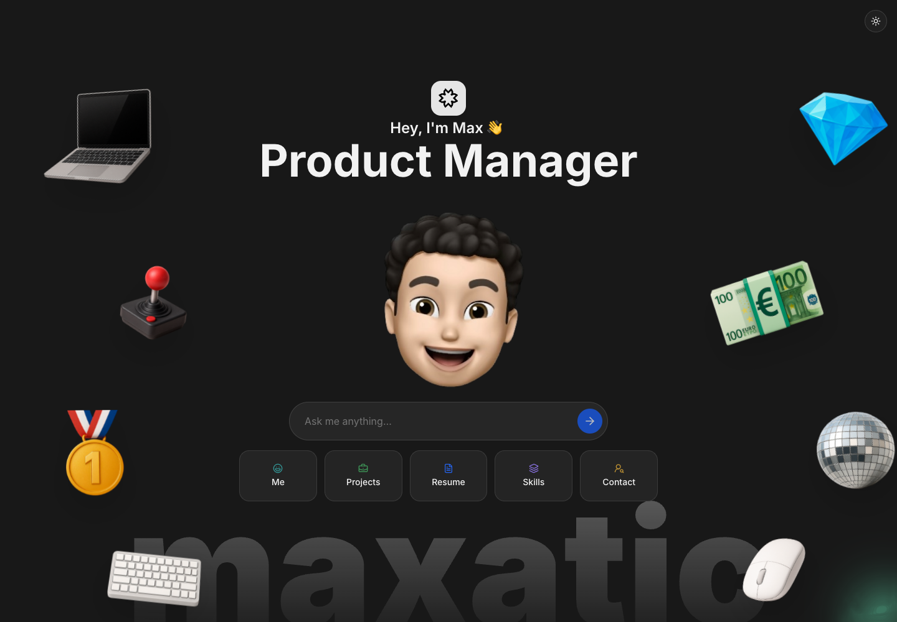
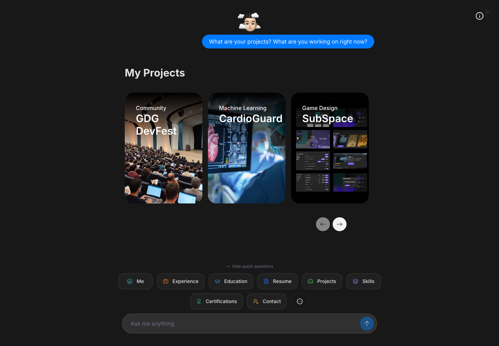

# Personal Portfolio

**Maxat (Max) Issaliyev · Product & Program Management · AI & Data**

My personal portfolio at **[maxat.tech](https://maxat.tech)**. Explore my projects,
experience, and background through a conversation: open a section for a quick overview,
or ask a question in your own words.

[](https://maxat.tech)

## Explore the portfolio

- **Meet Max:** an introduction, work experience, education, and certifications.
- **Browse projects:** visual cards with project details, from CardioGuard to GDG DevFest.
- **Review skills and resume:** technical and product skills, plus a downloadable CV.
- **Get in touch:** contact information and links.
- **Ask a follow-up:** streamed AI answers about my work, background, and approach to product.

Quick-question buttons open predefined cards without an AI request. Typed questions go
through the AI chat, which can bring the same cards into the conversation.



The interface supports light and dark themes and adapts to desktop and mobile screens.
Screenshots above were captured from the live site in October 2026.

## Built with

| Area           | Technology                                         |
| -------------- | -------------------------------------------------- |
| Application    | React 19, TypeScript, TanStack Start & Router      |
| Build & server | Vite, Nitro, Cloudflare Workers build target       |
| Interface      | Tailwind CSS 4, shadcn/ui, Radix UI, Framer Motion |
| AI chat        | AI SDK, Lovable AI Gateway, Gemini                 |
| Usage tracking | Supabase                                           |

## Run locally

Use **Node.js 22.12 or newer** and npm.

```bash
git clone https://github.com/maxatic/personal-portfolio.git
cd personal-portfolio
npm install
```

The checked-in npm lockfile currently needs syncing with `package.json`, so use
`npm install` rather than `npm ci` for this checkout. Bun also has a lockfile;
avoid mixing package managers when updating dependencies.

### Configuration

Create a `.env.local` file in the project root with your own configuration:

```dotenv
# AI chat (server only)
LOVABLE_API_KEY=your_lovable_api_key

# Supabase (server only)
SUPABASE_URL=https://your-project.supabase.co
SUPABASE_SERVICE_ROLE_KEY=your_service_role_key

# Supabase public client configuration
VITE_SUPABASE_URL=https://your-project.supabase.co
VITE_SUPABASE_PUBLISHABLE_KEY=your_publishable_key
```

For typed AI questions, apply the SQL in
[`supabase/migrations/20260619161955_f94d2fda-4a4b-4ccc-9a4d-1f420baf0a08.sql`](supabase/migrations/20260619161955_f94d2fda-4a4b-4ccc-9a4d-1f420baf0a08.sql)
to your Supabase database. It creates the `ai_usage` table used by the server's
six-question limit per hashed visitor IP. Quick-question cards do not use this table
or the AI gateway.

Keep the service-role key and AI key on the server. `.env.local` is ignored by Git;
only the `VITE_` variables above are intended for the browser.

The current chat handler reads `LOVABLE_API_KEY`. The `OPENAI_API_KEY` entry in the
legacy `.env.example` is unused. `GITHUB_TOKEN` is optional for the GitHub stars
helper, which still points to an older repository in
[`src/lib/api/github.functions.ts`](src/lib/api/github.functions.ts).

Load the server variables into your shell, then start the development server
(macOS/Linux):

```bash
set -a
. ./.env.local
set +a
npm run dev -- --port 3000
```

Open **[localhost:3000](http://localhost:3000)**. In a deployed environment, configure
the server variables as runtime secrets and the `VITE_` values at build time.

### Commands

| Command           | Purpose                                                   |
| ----------------- | --------------------------------------------------------- |
| `npm run dev`     | Start the development server; use the URL printed by Vite |
| `npm run build`   | Create the production build                               |
| `npm run preview` | Preview the production build locally                      |
| `npm run lint`    | Run ESLint                                                |
| `npm run format`  | Format the repository with Prettier                       |

## Find your way around

```text
src/routes/             Home, chat, and design showcase routes
src/components/         Portfolio sections, project cards, and chat UI
src/lib/chat/prompt.ts  Avatar instructions and background
src/lib/chat/tools/     Tools available to the AI assistant
src/lib/api/            Server functions for chat and GitHub integration
src/integrations/       Supabase clients and middleware
public/                Static site assets
assets/                README screenshots
supabase/migrations/   Database schema
```

Portfolio content lives in both the section components and the chat prompt/tools.
When updating a project, role, or skill, keep these sources consistent.
See [`DESIGN_SYSTEM.md`](DESIGN_SYSTEM.md) for the interface conventions.
